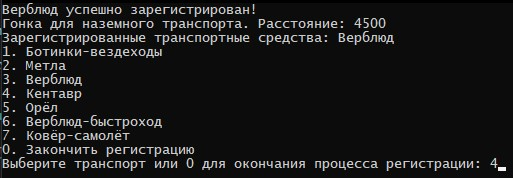
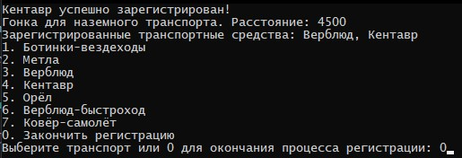
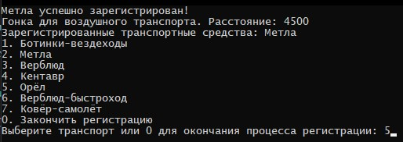
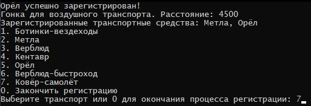

# Курсовой проект «Симулятор гонок»

Курсовой проект представляет собой простейшую реализацию симулятора гонок для фэнтезийных транспортных средств (ТС)

## Содержание

### 1. Правила игры
Все виды транспортных средств делятся на два типа:
 - наземные
 - воздушные
 
В симуляторе присутствуют несколько видов транспортных средств:
 - верблюд (наземное)
 - верблюд-быстроход (наземное)
 - кентавр (наземное)
 - ботинки-вездеходы (наземное)
 - ковер-самолет (воздушное)
 - орёл (воздушное)
 - метла (воздушное)

У всех транспортных средств есть заранее заданная скорость. Эта и все последующие числовые характеристики (такие как скорость, время и расстояние) указываются в условных единицах (у.е.)

В симуляторе есть несколько видов гонок:
 - только для наземных ТС
 - только для воздушных ТС
 - для наземных и воздушных ТС

#### Наземные ТС
Наземные транспортные средства не могут двигаться непрерывно - по прошествии определённого времени им нужно отдыхать. У каждого вида наземного транспортного средства это время своё

Время отдыха у каждого наземного транспортного средства также различается и зависит от того, какая по счёту это остановка

##### Пример 
Скорость ТС равна 100, дистанция равна 1000, время движения до отдыха равно 6, длительность отдыха равна 3. Тогда ТС пройдёт дистанцию за 1000 / 100 = 10 у.е. Так как время движения до отдыха равно 6, то по пути ТС нужно будет отдохнуть 1 раз. Итоговое время составит 10 + 3 = 13 у.е.

Ниже приведена сводная таблица характеристик для каждого наземного транспортного средства

| Вид ТС           | Скорость | Время движения до отдыха| Длительность отдыха
|------------------|----------|----------------------------|--------------------
| верблюд          | 10       | 30                         | первый раз: 5 все последующие разы: 8
| верблюд-быстроход| 40       | 10                         | первый раз: 5 второй раз: 6.5 все последующие разы: 8
| кентавр          | 15       | 8                          | всегда 2
| ботинки-вездеходы| 6        | 60                         | первый раз: 10 все последующие разы: 5

#### Воздушные ТС
Воздушные транспортные средства двигаются непрерывно

За счёт того, что они могут облетать препятствия, каждое воздушное транспортное средство обладает собственным коэффициентом сокращения расстояния --- то есть для каждого воздушного ТС дистанция, которую нужно пройти, уменьшается. Коэффициент сокращения расстояния может зависеть от дистанции

##### Пример 
Если у воздушного ТС коэффициент сокращения расстояния равен 5%, то вместо дистанции в 1000 у.е. ему нужно пройти дистанцию в 1000 * 0.95 = 950 у.е.

Ниже приведена сводная таблица характеристик для каждого воздушного транспортного средства

| Вид ТС           | Скорость | Коэффициент сокращения расстояния
|------------------|----------|----------------------------------
| ковер-самолет    | 10       | если расстояние меньше 1000 --- без сокращения если расстояние меньше 5000 --- 3% если расстояние меньше 10000 --- 10% если расстояние больше или равно 10000 --- 5%
| орёл             | 8        | всегда 6%
| метла            | 20       | увеличивается на 1% за каждую 1000 у.е. расстояния например, для расстояния 5600 коэффициент будет 5%

### 2. Требования к решению

Требования по функционированию программы:
1. При старте программы пользователю должен быть предложен выбор типа гонки
2. После выбора типа гонки пользователь должен указать расстояние для этой гонки
3. Затем пользователю должна быть предоставлена возможность зарегистрировать транспортные средства на гонку
4. Можно регистрировать не более одного экземпляра для каждого вида ТС
5. На гонку должно быть зарегистрировано хотя бы два вида ТС
6. Нельзя зарегистрировать на наземную гонку воздушное ТС, а на воздушную гонку наземное ТС
7. После завершения регистрации пользователь может либо зарегистрировать ещё какие-то ТС, либо начать гонку
8. Сама гонка происходит мгновенно, пользователю выводится результат гонки --- ТС-участники гонки и их время
9. Результаты участников должны выводиться по возрастанию времени --- самый быстрый оказывается наверху, самый медленный --- внизу
10. Вместе с результатами гонки пользователю должен быть предложен выбор --- провести ещё одну гонку (программа стартует с начала) или выйти из программы

Требования к структуре и реализации программы:
1. Для реализации транспортных средств и гонок должны быть использованы иерархии классов
2. Для каждого класса должна быть создана пара заголовочный файл + файл исходного кода
3. Классы транспортных средств, гонок и другие вспомогательные классы должны находиться в отдельной динамической библиотеке (DLL)
4. В основном проекте (.exe) должен находиться код для взаимодействия с пользователем и использование классов из вашей библиотеки в ответ на действия пользователя
5. Классы библиотеки не должны самостоятельно выводить данные на консоль

### 3. Пример пошаговой работы программы

______

### Как правильно задавать вопросы преподавателю?

Что поможет решить большинство частых проблем:

1. Работа над проектом объемная. Вы можете сдавать работу на проверку: частями или полностью. Вы можете сдать часть кода и получить обратную связь, после чего работа будет отправлена на доработку и вы сможете продолжить. 
2. При возникновении вопросов попробовать найти ответ сначала самому в интернете. Умение искать ответы пригодится вам в профессиональной деятельности. После самостоятельного поиска можно спрашивать преподавателя.
3. Если вопросов больше одного, то присылайте их в виде нумерованного списка. Так дипломному руководителю будет проще отвечать на каждый из них.
4. При необходимости прикрепите к вопросу скриншоты и стрелочкой покажите, где не получается. Программу для этого можно скачать [здесь](https://app.prntscr.com/ru).
5. Распределяйте нагрузку, планируйте время на обучение и начинайте работу над курсовой как можно раньше, чтобы у вас было больше времени на правки и доработку проекта.

Что может стать источником проблем:

1. Вопросы вида «Ничего не работает. Не запускается. Всё сломалось». Преподаватель не сможет ответить на такой вопрос без дополнительных уточнений. Цените своё время и время других.
2. Откладывание выполнения курсового проекта на последний момент.
3. Ожидание моментального ответа на свой вопрос. Преподаватели — работающие разработчики, которые кроме преподавания занимаются рабочими проектами. Их время ограничено, поэтому постарайтесь задавать правильные вопросы, чтобы получать быстрые ответы :)

______

### Инструкция по сдаче курсовой работы

1. Выполняйте работу в [GitHub](https://github.com/)
2. Скопированную ссылку (вашу курсовую работу) нужно отправить на проверку. Для этого перейдите в личный кабинет на сайте [netology.ru](http://netology.ru/), в поле комментария к домашней работе вставьте скопированную ссылку и отправьте работу на проверку.
3. Работу можно сдавать частями

_Никаких файлов прикреплять не нужно._

### Критерии оценки:

1. К личном кабинете для сдачи прикреплена ссылка repl с кодом курсовой работы
2. В ссылке должен содержаться код, который при запуске выполняет описанный в задании алгоритм
